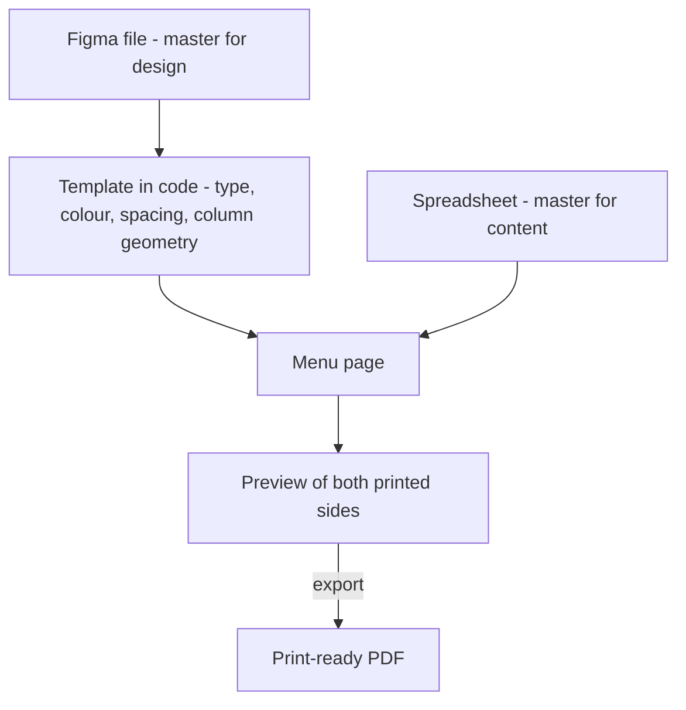
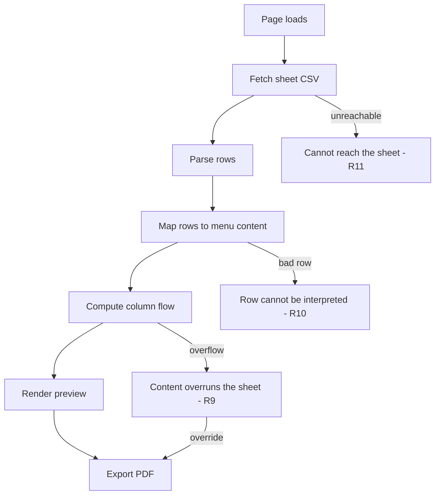

# Spreadsheet-Backed Menu Content - Plan

## Goal Capsule

- **Objective:** Let winery staff change menu content themselves and produce the print-ready PDF, without Figma, without the designer, and without any ability to alter the design.
- **Product authority:** This plan owns the content surface, the preview, and the export path for the existing food menu in `menus/`. It does not own the menu's visual design, which stays in Figma and in `menus/src/menus/templates/`.
- **Authority hierarchy:** Requirements (R-IDs) win on product behavior. Key Technical Decisions (KTD-IDs) win on mechanism within their cited requirements. Implementation units override neither.
- **Execution profile:** Sequential with one exception — U1 before U2, U3 before U4, U6 before U5 and U8, U9 last; U7 is independent and can run alongside U4. See Sequencing.
- **Stop conditions:** Stop and surface rather than guess if the CSV endpoint does not return readable content from the browser, or if the static export cannot produce a PDF carrying the embedded typefaces. Both invalidate the approach rather than the plan.
- **Open blockers:** None.

---

## Product Contract

**Product Contract preservation:** unchanged, except Outstanding Questions — its four deferred items were resolved during planning and removed rather than left standing (see KTD1, KTD2, KTD4, KTD5).

### Summary

Move menu content out of the app and into a spreadsheet the winery edits directly. A static page reads that spreadsheet, renders a faithful preview of both printed sides, and exports the print-ready PDF in the browser. The sign-in, the save endpoint, and the server-side content store are removed.

### Problem Frame

Every menu change currently routes through one person. The designer edits the menu in Figma, exports a print-ready file, and sends it to the winery to print. The winery has asked to make changes without that round trip, while keeping the branding the designer built for them.

The winery is new — this is their second menu, and their first with a designer. Their changes so far are item names and prices. Before this, they made menus in Canva.

The app in `menus/` was built to close that gap and already produces the real artefact: two 11x17 pages, five typefaces embedded and subsetted, the watermark with its alpha mask, column placement matching the artboard. What it also carries is a sign-in, a save endpoint, and a filesystem content store — three things that must be hosted, maintained, and kept working indefinitely for a menu that changes a handful of times a year.

There is a second problem underneath the first. Once the designer is out of the loop, nobody checks the output before it reaches a printer, and the preview becomes the only check. The preview and the PDF agree today, but by coincidence rather than by construction: both renderers write out the same design values independently instead of reading them from the shared template. The season label's size and its `5.88` letter-spacing are hardcoded in both files, and the theme's own `tracking.seasonLabel` holds `3`, which neither renderer reads. The first time someone edits one renderer and not the other, the preview starts lying, and nobody is positioned to catch it.

### Key Decisions

- KD1. **Menu content lives in a spreadsheet, not in the app.** (session-settled: user-directed — chosen over finishing the built-in editor and over adopting a locked-template product: it removes the sign-in, the content store, and the running server from what has to be maintained.) Governs R1, R2, R12.
- KD2. **The winery owns all menu content, not just names and prices.** (session-settled: user-directed — chosen over text-only editing of existing items: a full seasonal rewrite becomes theirs, and the designer is involved only when the design changes.) Governs R2.
- KD3. **Design and content never live in the same document.** Figma is master for design; the spreadsheet is master for content. Neither holds the other's values, so a seasonal redesign never has to be reconciled against edits made in the meantime. Governs R4, R6.
- KD4. **The preview is a gate, not a convenience.** (session-settled: user-directed — the winery exports unsupervised, so a preview that disagrees with the PDF is worse than no preview.) Governs R5, R6.
- KD5. **Locked-template products were considered and rejected.** Their locks are advisory rather than enforced, and their fixed canvases break on variable-length text — the failure mode this menu is most exposed to. See Sources / Research.
- KD6. **Content that overruns the sheet blocks export, with a deliberate override.** (session-settled: user-directed — chosen over blocking outright and over warning only: the fit check estimates from character counts and runs about 1% generous, so a hard block could strand a menu that would have printed fine.) Governs R9.

The split KD3 describes, and where each source of truth reaches:

### Actors

- A1. **Winery staff** — non-technical. Edit menu content and produce the printable file. Have no designer reviewing their output.
- A2. **Designer** — owns the menu's visual design and remains design of record. Involved when the design changes, not when content changes.

### Requirements

**Content source**

- R1. Menu content lives in a spreadsheet that A1 edits directly, and that spreadsheet is the only source of menu content.
- R2. The spreadsheet carries everything the menu's content model holds today: the season header, sections, notes, per-item name, price, description, dietary tags, add-on line and pairing line, and both footer lines.
- R3. Dietary tags are constrained to the fixed vocabulary. The spreadsheet guides the choice, and the page rejects any value outside it.
- R4. No design value is representable in the spreadsheet. Typeface, size, colour, spacing, column placement, logo and watermark cannot be changed from it.

**Preview and export**

- R5. The page renders a preview of both printed sides, and export is reachable only from that preview.
- R6. The preview reads every design value from the template and holds none of its own, so it cannot disagree with the PDF about type size, spacing, colour, or typeface.
- R7. Export produces the same print-ready artefact the app produces today: two 11x17 sides, typefaces embedded and subsetted, watermark with its alpha mask intact.
- R8. Which column a section prints in stays computed from how much content there is. No one chooses it and it is not stored.

**Failure handling**

- R9. When content exceeds the printable area, the page names the column that overruns and disables export. A1 can override and export anyway through a deliberate confirmation.
- R10. Content the page cannot interpret produces an on-page explanation identifying the offending row, not a blank sheet and not a crash.
- R11. When the spreadsheet cannot be reached, the page says so rather than rendering an empty menu.

**Hosting and access**

- R12. The page is static. Nothing renders on a server at request time, and no content is persisted server-side.
- R13. The page is served from a location where its root-absolute asset paths resolve, so the typefaces and watermark load and the exported PDF is complete.
- R14. There is no sign-in.

### Key Flows

- F1. Winery changes a price
  - **Trigger:** A1 needs an item's price corrected.
  - **Steps:** A1 edits the cell in the spreadsheet, opens the menu page, reads the preview, exports the PDF, prints it.
  - **Outcome:** A new printed menu, with no involvement from A2.
  - **Covered by:** R1, R5, R7, R14

- F2. Winery rewrites the menu for a new season
  - **Trigger:** A1 replaces most of the menu's items and sections.
  - **Steps:** A1 restructures rows in the spreadsheet, opens the page, and reads the preview — including the fit warning, since a rewrite is the most likely way to overrun the sheet. A1 adjusts content until it fits, then exports.
  - **Outcome:** A new menu, in the existing design, without a redesign.
  - **Covered by:** R2, R5, R8, R9

- F3. Designer changes the design
  - **Trigger:** A2 revises the menu's visual design in Figma.
  - **Steps:** A2 updates the template in code to match. Content is untouched; whatever is in the spreadsheet at that moment flows into the new design.
  - **Outcome:** A redesigned menu carrying current content, with nothing reconciled by hand.
  - **Covered by:** R4, R6

### Acceptance Examples

- AE1. **Covers R6.** Given the template sets the season label to a given size, when the preview and the PDF are compared at that label, then both render it at that size.
- AE2. **Covers R9.** Given content that overruns the printable area, when A1 opens the page, then the page names the column that overruns and export is disabled.
- AE3. **Covers R10.** Given a row with a dietary tag outside the fixed vocabulary, when the page loads, then the menu renders with that tag dropped and a visible warning names the offending row, rather than failing blank or discarding the tag silently.
- AE4. **Covers R11.** Given the spreadsheet is unreachable, when A1 opens the page, then the page reports that it could not load the content, and no export is offered.
- AE5. **Covers R4.** Given A1 adds a column to the spreadsheet named for a font or a colour, when the page loads, then the rendered menu is unchanged.
- AE6. **Covers R13.** Given the page is served from its intended location, when A1 exports the PDF, then the exported file carries the embedded typefaces rather than substituted ones.
- AE7. **Covers R9.** Given content that overruns and A1 has confirmed the override, when A1 exports, then the PDF is produced with the overrun intact.

### Success Criteria

- A1 completes a content change and holds a print-ready file without contacting A2.
- A menu that reads as correct in the preview prints as correct.
- A2 spends no time on content changes.

### Scope Boundaries

**Deferred for later**

- The wine menu. One menu exists in the registry today; the mechanism should extend to a second without redesign, but the second menu is not this work.
- Version history and a library of past menus. The spreadsheet keeps its own revision history, so the app does not need to grow one.

**Deferred to follow-up work**

- Recovering row order after someone runs `Data → Sort`. An Apps Script stamping a hidden sequence column would make order restorable, but it adds a script dependency to a browser-only page. Wait until a sort actually happens.
- Caching the last successfully parsed content in `localStorage` as a last-known-good.

**Not in scope**

- Adopting Canva, Marq, or Adobe Express. Recorded as the fallback rather than the direction — see Dependencies / Assumptions.
- Per-user identity or an audit trail. R14 removes sign-in entirely; who changed a price is not recorded and is not intended to be.
- The line-breaking difference between the browser and the PDF renderer. This is distinct from the design-value drift R6 removes: browser and `@react-pdf/renderer` wrap text with different algorithms, so a nearly full column may show one more or one fewer line than it prints. That difference is inherent to running two renderers and is not closed by this work.

### Dependencies / Assumptions

- `@react-pdf/renderer` v4 works under a static export. Unverified — settling it needs a real build. The library already runs browser-only through a `browser` field that selects a Node-free build, which is the reason to expect it will.
- A published spreadsheet can be fetched from the browser. Verified empirically by a cross-origin `fetch()` from a real browser against all four Google read paths; each returned a readable body. Nothing in this repo obstructs it — no Content-Security-Policy, no configured headers or rewrites.
- The winery holds a Canva subscription of unknown tier. The fallback named in Scope Boundaries depends on it being Pro or higher, since custom font upload and CMYK export are unavailable on the free tier.
- End-to-end latency from a sheet edit to a visible change is unmeasured. The chosen endpoint sends `no-cache, no-store` and involves no publish snapshot, so it should be immediate. Confirm against the winery's real sheet before handing it over.

---

## Planning Contract

### Key Technical Decisions

- KTD1. **Read the sheet through its CSV export endpoint, from the browser, on page load.** Chosen over publish-to-web, whose response carries a five-minute client cache on top of Google's own republish lag, and over the `gviz/tq` endpoint, which infers one type per column and can silently null a mixed free-text price column. The export endpoint returns displayed values verbatim, trims to the used range, and sends `no-cache, no-store`. It 307-redirects to a `googleusercontent.com` host and both hops carry CORS headers, so the fetch must be allowed to follow redirects. **The endpoint returns one tab per request**, addressed by a numeric tab id distinct from the spreadsheet id — so the two tabs KTD2 defines are two fetches, not one. Publish-to-web is the retained fallback if the export endpoint changes shape: switching is a URL change plus accepting its five-minute cache, which keeps recovery a configuration change rather than a code change. Governs R1, R11.
- KTD2. **One `Menu` tab with a `type` discriminator column and implicit row order, plus a `Settings` key-value tab for the document-level strings.** Section membership is positional: an item belongs to the nearest section row above it. Rejected an explicit order column — autofill from a single cell duplicates values, mid-list inserts force hand-renumbering, and a second source of order lets the sheet show one order while printing another. Governs R2.
- KTD3. **Parse with PapaParse rather than string splitting.** Descriptions carry newlines and item names carry commas; both break naive splitting on the first row of real content. The endpoint returns CRLF line endings and RFC 4180 quoting. PapaParse handles all three, has no dependencies, and adds about 7 KB gzipped. Pin the delimiter and leave type inference off, so `8` and `2019` stay strings. Parse by header name, not column index. Governs R2, R10.
- KTD4. **Re-validate dietary tags in the page.** Sheet data validation rejects bad input at typing time, but paste defeats it and the constraint appears nowhere in the exported CSV. A tag outside the vocabulary is dropped with a visible warning rather than thrown. Governs R3, R10.
- KTD5. **Serve from a domain root.** (session-settled: user-directed — chosen over a GitHub Pages project page: root serving keeps the existing root-absolute font and watermark paths working, avoiding an asset-path indirection across four call sites and the silent deletion of `_next/` by Jekyll.) Governs R13.
- KTD6. **Delete the middleware as its own step, before the export config lands.** Under `output: 'export'` Next reads `middleware.ts` only to set a telemetry flag — no error, no warning. The build succeeds and the passcode gate ceases to exist while the site still looks correct. Every other unsupported feature fails the build by filename. Governs R12, R14.
- KTD7. **Keep the existing bare dynamic import of the PDF renderer inside the click handler.** It is the one pattern that compiles against the installed Next 14.2.35; switching to `next/dynamic` with `ssr: false` fails with an ESM resolution error, and placing the renderer in a render tree fails the build outright. Governs R7.
- KTD8. **Stay on Next 14.** Nothing in 15 improves static export for this app, and 15 turns the request APIs async — a breaking migration bought for nothing. Governs R12.
- KTD9. **Add a test runner scoped to the sheet-parsing layer.** (session-settled: user-approved — chosen over staying with build-plus-manual verification: parsing and mapping is where breakage on real content stays silent, and it is the only part of this work with logic worth proving.) Governs R2, R3, R10.

### High-Level Technical Design

The page has one runtime pipeline with three failure exits. Each exit corresponds to a requirement, and each is a state the winery can reach without a designer present.

Two things about this shape are load-bearing. The pipeline runs entirely in the browser, so every stage is reachable from a static file server. And export hangs off the preview rather than off the loaded content, which is what makes R5's gate structural instead of a convention.

### Assumptions and constraints

- The spreadsheet is public to anyone holding its ID, and the ID ships inside the page's JavaScript. It must therefore be a dedicated spreadsheet holding nothing but the two tabs KTD2 defines — no costs, supplier names, staff notes, or extra tabs. Published sheets are not search-indexable, but not-indexed is not private.
- Sheet data validation is an editor affordance, never a data guarantee. KTD4 exists because of this.
- Value coercion happens when a value is typed, not when it is exported. A price typed as `$8` into a general-formatted cell is stored as the number 8 and exports as `$8.00`, and reformatting the column afterward does not restore it — the cell must be retyped. The price and name columns must be plain text before any data is entered.
- Hidden and filtered rows still export. Staff who hide a row to remove an item will still see it printed.

### Sequencing

U1 lands before U2, so the middleware is gone deliberately rather than silently (KTD6). U3 lands before U4, so the loader is written against a real sheet rather than an imagined one. U6 lands before U5 and U8 — all three change the same component, and U6 rewrites what the other two extend. U7 is independent of the loader and can run in parallel with U4. U9 is last and needs U2 and U6.

Two consequences of that order are worth stating. U1 leaves the type graph broken — the route page still hands content to a component whose imports it deleted — and U2's temporary literal is what closes it, so the build is green from U2 onward rather than only after U6. And U4 reads the spreadsheet and tab ids from public environment variables from the start, so U9 configures values instead of rewriting a module.

### Risks and rollout

| Risk | Mitigation |
|---|---|
| The PDF renderer does not survive a static export. This invalidates the approach, not the plan. | U2 proves it before any loader work is written. It is a Goal Capsule stop condition — surface it rather than working around it. |
| Typefaces fail to load and the PDF exports in a substituted face, which looks plausible. | KTD5 removes the subpath case entirely. U9 verifies against a downloaded file rather than the preview, and U8 makes the underlying error visible instead of generic. |
| Staff run `Data → Sort` and the printed column order changes silently. | U3 adds conditional formatting so a scrambled sheet looks wrong, and the instruction card names the hazard. Recovery is `Ctrl+Z` or the sheet's version history. A durable fix is deferred — see Scope Boundaries. |
| A price typed before the column was set to plain text prints as `$8.00`. | U3 formats the column before any data is entered. Not recoverable afterward by reformatting; the cell must be retyped. |
| The sheet is unreachable in the hour the winery needs to print. | R11 makes the failure legible rather than silent. The last exported PDF remains printable — see rollback below. |
| A paste into the sheet carries its own validation rules over and defeats the tag constraint. | KTD4 re-validates in the page, so the constraint holds where it matters even when the sheet's does not. |
| Google changes the export endpoint durably — drops a CORS header, alters the redirect, or throttles sustained. The winery loses the self-serve path entirely and can only recover through the designer. | KTD1 names publish-to-web as the retained fallback: a URL change and an accepted five-minute cache, not a code change. |
| Content sits right at the column limit. Three tolerances stack there and none is measured together: the estimator runs ~1% generous, the two renderers wrap text differently, and the override deliberately re-enables export. | U8 and U9 verify a near-capacity case against a downloaded PDF rather than only clearly-fitting and clearly-overrunning content. |
| U7 changes the printed design while consolidating values. The two renderers agree today, so a careless consolidation would move the menu rather than lock it. | U7 corrects theme keys to the values that print, never the reverse, and proves it by comparing exported PDFs before and after rather than by type-checking. |

**Rollback.** There is no data to roll back — the design lives in Figma and in `menus/src/menus/templates/`, and the content lives in a spreadsheet with its own revision history. If the deployed page breaks, the winery reprints the last exported PDF, and the designer can export from a local dev server in the meantime. Nothing about this change can lose a menu.

---

## Implementation Units

### U1. Remove the server surface

**Goal:** Delete everything that requires a running server, so the static export in U2 has nothing left to reject.

**Requirements:** R12, R14. Implements KTD6.

**Dependencies:** none.

**Files:**
- `menus/src/middleware.ts` (delete)
- `menus/src/lib/auth.ts` (delete)
- `menus/src/app/api/login/route.ts` (delete)
- `menus/src/app/api/logout/route.ts` (delete)
- `menus/src/app/api/menus/[menuId]/route.ts` (delete)
- `menus/src/lib/store.ts` (delete)
- `menus/src/app/login/page.tsx` (delete)
- `menus/src/components/SignOutButton.tsx` (delete)
- `menus/src/app/page.tsx` (imports and renders `SignOutButton` — breaks without this)
- `menus/src/app/layout.tsx` (metadata description mentions editing)
- `menus/src/app/globals.css` (a comment explains a font path in terms of the deleted middleware's matcher)
- `menus/.env.local.example` (remove both variables)
- `menus/data/menus.json` (delete — orphaned once the store is gone)
- `.gitignore` (its `menus/data/` entries lose their subject)
- `menus/src/lib/seed.ts` (keep — U3 uses its content to populate the starter sheet)

**Approach:**
1. Delete `menus/src/middleware.ts` first and on its own. Per KTD6 the build will not tell you it mattered.
2. Delete the auth module, the three route handlers, the store, the login page, and the sign-out button.
3. Remove both variables from the environment example. It is then empty until U4 adds the spreadsheet and tab ids.
4. Remove the resulting dead imports and stale comments. `menus/src/app/edit/[menuId]/page.tsx` and `menus/src/components/Editor.tsx` reference deleted modules and are rewritten in U2 and U6, so the type graph stays broken until U6 lands — see Sequencing.

**Execution note:** Verify by absence, not by the build — grep for references to the deleted modules rather than trusting a green compile, since a passing build is exactly what KTD6 warns about.

**Test expectation: none** — deletion only, with no behavior to assert that U2's build gate does not already cover.

**Verification:** No source file references `middleware`, `lib/auth`, `lib/store`, or the deleted routes. `menus/data/` is no longer read by any code path.

---

### U2. Convert the app to a static export

**Goal:** `next build` produces a fully static `out/` directory with no server-rendered route.

**Requirements:** R12. Implements KTD8.

**Dependencies:** U1.

**Files:**
- `menus/next.config.mjs`
- `menus/src/app/edit/[menuId]/page.tsx`

**Approach:**
1. Add `output: 'export'` to the Next config, with `trailingSlash: true` so each route emits a directory index. Without it the build writes a bare `.html` file and the deployed URL resolves only on hosts that map extensionless requests — which makes the winery's only URL a host-configuration dependency rather than a property of the build.
2. Remove `export const runtime` and `export const dynamic` from the edit page. `force-dynamic` is a hard build error under export, and `runtime` is a no-op.
3. Add `generateStaticParams` to the edit page, returning the ids from `menus/src/menus/registry.ts`. It is mandatory for any dynamic segment under export, even with one id.
4. Make the page a synchronous shell that renders the client component, passing the existing seed content as a temporary literal. It currently reads from disk; that read moves to the client in U6, which removes the literal. The temporary value is what lets the build go green here — without it the type graph stays broken until U6 and this unit cannot prove anything.
5. Remove the `canvas` webpack alias and its comment while in this file. The comment asserts the alias is needed for the browser bundle; nothing in the dependency tree imports `canvas`, and builds with and without it produce identical output. Leaving a comment we have disproved would mislead the next reader.

**Patterns to follow:** `menus/src/menus/registry.ts` exposes `MENU_IDS` as a string array; `generateStaticParams` needs objects keyed by the segment name, so it maps rather than returns the array directly.

**Test expectation: none** — configuration change; the build is the assertion.

**Verification:** `npm run build` completes green and writes `out/`. Serving `out/` over a static file server renders the menu route, and pressing Export downloads a PDF whose typefaces are embedded. This is where the approach-invalidating assumption is settled — a type-check alone proves nothing about whether the PDF renderer survives the export.

---

### U3. Define the spreadsheet contract and build the starter sheet

**Goal:** A real spreadsheet exists in the shape U4 will parse, with the guard rails that prevent the failure modes code cannot fix.

**Requirements:** R1, R2, R3. Implements KTD2.

**Dependencies:** none.

**Files:**
- `menus/README.md` (document the sheet contract; update the "Where things live" table and the "Adding the wine menu" recipe, both of which still route through the deleted store and seed file)
- `menus/docs/sheet-setup.md` (new — the winery-facing instruction card)
- The spreadsheet itself (external artefact, not in the repo)

**Approach:**
1. Define the `Menu` tab: a `type` column taking `section`, `item`, or `note`, plus the columns each type uses. Row order is the menu order; an item belongs to the nearest `section` row above it.
2. Define the `Settings` tab as `key | value` rows carrying `season`, `disclaimer`, and `serviceCharge`.
3. Choose a multi-tag delimiter that is not a comma — `|` or `;` — since the export is comma-separated.
4. Format the price and name columns as plain text **before** entering any data. See the coercion constraint in Assumptions; this is not recoverable afterward.
5. Populate from the existing seed content in `menus/src/lib/seed.ts` so the first render is a known-good menu.
6. Add data validation on `type` and on tags, set to reject rather than warn, applied to whole columns rather than a fixed range.
7. Add conditional formatting by `type` so a destroyed row order is visible rather than silent, and a warning column flagging blank type, an item before any section, a blank name, and a tag outside the vocabulary.
8. Create the spreadsheet in an account the winery owns, with the designer holding editor access rather than ownership. If the designer owns it, adding a staff editor, recovering access, or transferring the file all route back through the designer — the round trip this plan exists to remove.
9. Set general access to "anyone with the link — viewer", and grant editing only to named winery accounts. Since the sheet id ships in the page's JavaScript and there is no sign-in, link-level editing would let anyone who opens the page rewrite the printed menu. Google account sharing is now the entire write-authorization boundary the passcode used to hold.
10. Write the instruction card. It must cover: the sheet is readable by anyone holding the link, so nothing but menu content goes in it; never use `Data → Sort` (use filter views); hidden and filtered rows still print; and the price column is plain text on purpose.

**Test expectation: none** — this unit produces a document and an external artefact, not code. U4's tests assert against the shape it defines.

**Verification:** Both tabs' CSV export endpoints return the seed menu's content. General access is link-viewer, not link-editor, and the file is owned by a winery account. The instruction card names the public-readability, sort, hidden-row, and plain-text price hazards.

---

### U4. Load, parse, and map sheet content

**Goal:** A module that turns the sheet's CSV into the existing `MenuContent` shape, or into a described failure.

**Requirements:** R1, R2, R3, R4. Serves F1, F2. Implements KTD1, KTD3, KTD4, KTD9.

**Dependencies:** U3.

**Files:**
- `menus/src/lib/sheet.ts` (new — fetch, parse, map)
- `menus/src/lib/sheet.test.ts` (new)
- `menus/package.json` (add the test runner and CSV parser; add a `test` script)
- `menus/tsconfig.json` (its include globs pick up test files, so the runner's types must resolve or the build gate fails on them)
- `menus/src/lib/schema.ts` (extend with the row-level guards the mapper needs)
- `menus/src/menus/templates/theme.ts` (remove the duplicate dietary-tag set)
- `menus/.env.local.example` (the spreadsheet id and both tab ids)

**Approach:**
1. Fetch both tabs. The export endpoint returns one tab per request, so the `Menu` tab and the `Settings` tab are two requests, each addressed by its own numeric tab id (KTD1). Read the spreadsheet id and both tab ids from public build-time environment variables from the start, so U9 configures values rather than rewriting this module.
2. Fetch with `cache: 'no-store'`. Do not set `redirect` to `manual` or `error` — the endpoint 307-redirects and both hops carry CORS headers.
3. Treat a response that is not CSV as unreachable, even at status 200. A sheet whose sharing was revoked answers with an HTML interstitial, which would otherwise parse into rows with blank types and surface as a row error instead of R11's "cannot reach the sheet".
4. Parse with headers on, empty lines skipped greedily, the delimiter pinned to a comma, and type inference off so `8` and `2019` stay strings.
5. Fold rows into the ordered block list: a `section` row opens a section, subsequent `item` rows attach to it, a `note` row emits a standalone block.
6. Synthesize block and item ids deterministically from the sheet row number. `MenuContent` requires an id on every block and item, the column set has none, and the existing id helper is random — which would break fixture equality in tests and destroy the stable row identity U5 needs to mark a bad row's position.
7. Normalize and re-validate tags against the fixed vocabulary — trim, collapse whitespace, normalize Unicode, lowercase, match against the canonical set (KTD4). The canonical set is the one in `menus/src/lib/schema.ts`; a second, unread copy sits in `menus/src/menus/templates/theme.ts` and should be deleted so only one exists.
8. Read the `Settings` tab into the season and footer strings.
9. Return mapped content or a structured failure. Zero mapped blocks is a described failure, not success — a cleared tab must not render as a blank menu. Never throw past the caller.

**Patterns to follow:** `menus/src/lib/schema.ts` already establishes the nested type-guard convention (`isDietaryTag` → `isMenuItem` → `isMenuBlock` → `isMenuContent`) and the reject-rather-than-coerce rule. Extend it rather than introducing a second validation style.

**Execution note:** Write the mapper test-first against fixture CSV captured from the real sheet in U3, including one fixture with a genuine embedded newline and one with a comma inside a quoted name — those two are what naive parsing breaks on.

**Test scenarios:**
- A well-formed sheet with two sections and one note maps to blocks in sheet order.
- An item row appearing after a section row attaches to that section.
- An item row appearing before any section row is reported as a failure naming that row.
- A description containing an embedded newline survives parsing with the newline intact.
- An item name containing a comma inside quotes does not shift later columns.
- A price of `$14 / $48` maps through unchanged.
- A price cell containing `$8.00` maps through as written, since the mapper cannot know it was typed as `$8`.
- Covers AE3. A tag outside the fixed vocabulary is dropped, and the result carries a warning naming that row.
- A tag cell holding several delimited tags maps to the full tag list.
- A row with a blank `type` is reported as a failure naming that row.
- A row with trailing empty columns omitted still maps.
- A `Settings` tab missing a key yields an empty string for it rather than a failure.
- Covers AE4. A fetch rejection returns the unreachable failure rather than empty content.
- A non-200 response returns the unreachable failure.
- A 200 response carrying HTML rather than CSV returns the unreachable failure, not a row-level error.
- A `Settings` fetch that fails while the `Menu` fetch succeeds returns a described failure rather than a menu with blank header and footer strings.
- A `Menu` tab with a header row and no data rows returns the empty-content failure rather than content with zero blocks.
- The same fixture maps to the same block and item ids on repeated parses.
- CRLF line endings do not leave a trailing carriage return on the last field of a row.

**Verification:** `npm run test` passes. Fixtures include at least one CSV captured verbatim from the real sheet.

---

### U6. Rewire the page around read-only content

**Goal:** The page loads content from the sheet and offers preview and export only. Editing controls are gone.

**Requirements:** R1, R4, R5, R8, R12, R14. Serves F1, F2.

**Dependencies:** U2, U4.

**Files:**
- `menus/src/components/Editor.tsx`
- `menus/src/components/MenuForm.tsx` (delete)
- `menus/src/app/globals.css` (the field, chip, snackbar, and two-column editor rules lose their only consumers)
- `menus/src/app/edit/[menuId]/page.tsx` → `menus/src/app/menu/[menuId]/page.tsx` (rename)
- `menus/src/app/page.tsx`

**Approach:**
1. Load content in the client component via an effect, per the supported pattern for static export. Whatever renders before data arrives must be identical on server and client — no `window`, `Date`, or `localStorage` reads during render, or the build's prerendered shell mismatches on hydration.
2. Specify what renders while the fetch is in flight. Every page load crosses a network and a redirect, so an unnamed interval is the state the winery sees most often — and with no loading surface they cannot tell "still reading" from "broken" from "the menu is empty". The app bar renders immediately, the preview area carries an indeterminate progress indicator, and no export control exists until content resolves. `globals.css` has no progress indicator today, so one is added.
3. Remove the temporary seed literal U2 introduced, replacing it with the loaded content.
4. Delete the form, the save handler, the dirty-state tracking, and the unsaved-changes warning. None have meaning when the sheet is the source.
5. Rename the route from `edit` to `menu`. Nothing is edited there anymore, and a route named `edit` will mislead.
6. Keep the export handler's bare dynamic import exactly as it is (KTD7).
7. Update the home page to link the renamed route. It currently lists menu types from the registry and touches no content — that stays true.

**Patterns to follow:** `menus/src/components/Editor.tsx` already isolates the PDF engine behind a dynamic import inside the click handler; `menus/src/menus/templates/index.tsx` dispatches on the menu **type** id. Keep passing the type id, not any sheet identifier, or the template lookup silently returns nothing.

**Test scenarios:**
- Covers AE5. Given the sheet carries an extra column named for a font, the rendered menu is unchanged.
- Given the fetch is in flight, the loading surface renders and no export control is present.
- Given content loads, the preview renders both printed sides and the loading surface is gone.
- Given the page has loaded, no control exists that writes content anywhere.
- An id outside the generated set has no page at all under static export, so the host's 404 is the behavior and there is no in-app not-found state to assert.

**Verification:** `npm run build` stays green. The running page renders the seed menu from the real sheet.

---

### U5. Surface content failures in the page

**Goal:** Every failure U4 can return renders as something the winery can act on.

**Requirements:** R10, R11. Serves F2.

**Dependencies:** U4, U6. U6 rewrites the component this unit extends, so it lands first despite the lower number.

**Files:**
- `menus/src/components/Editor.tsx`
- `menus/src/app/globals.css` (only if a new state needs a class the sheet does not have)

**Approach:**
1. Render the unreachable-sheet failure as a page-level message that offers no export (R11), paired with a retry that re-runs the loader. A message with no action leaves non-technical staff stranded in exactly the scenario the risk table names. The deleted save-error snackbar already paired its message with a retry; carry that affordance forward.
2. Render a row-level failure inline at the position the bad row would have occupied, so the editor debugs by looking rather than by reading a list. The marker is preview-only and cannot appear in the PDF, so its copy must say the row will not print.
3. Render tag warnings as a single grouped surface above the preview, listing every affected row and stating that export is unaffected. Without a surface distinct from the blocking states, a dropped tag looks identical to an overflow that stops the print run.
4. Render an empty-sheet state when the sheet is reachable but maps to no blocks, offering no export. Clearing the rows mid-rewrite is a normal step in the seasonal flow, and two blank printed sides with export enabled is the worst reachable outcome.

**Patterns to follow:** `menus/src/components/Editor.tsx` already has an `ErrorCard` used for the overflow condition, and `globals.css` provides `md-card.error`. Reuse both; the repo removed card variants on purpose and does not want new ones.

**Test scenarios:**
- Covers AE4. Given the sheet is unreachable, the page shows the unreachable message and renders no export control.
- Given the unreachable message is shown, retrying re-runs the loader.
- Given one uninterpretable row, the page renders the rest of the menu, marks that row's position, and leaves export enabled.
- Given a tag outside the vocabulary, the menu renders without that tag, a warning names the row, and export stays enabled.
- Given a reachable sheet with no menu rows, the empty state renders and no export control is present.
- Given content that loads cleanly, no error or warning surface appears.

**Verification:** Each of the four failure kinds is reachable in the running app by manipulating the sheet.

---

### U7. Consolidate design values into the template

**Goal:** Both renderers read every design value from one place, so neither can drift from the other.

**Requirements:** R6. Serves F3. Implements Key Decision KD4.

**Dependencies:** none.

**Files:**
- `menus/src/menus/templates/theme.ts`
- `menus/src/menus/templates/FoodMenu.tsx`
- `menus/src/components/MenuPreview.tsx`
- `menus/src/app/globals.css` (the `@font-face` families the preview's CSS stacks bind to)

**Approach:**
1. Preserve the printed design exactly. The two renderers agree today, and what they agree on is the menu the winery prints. Where a theme key disagrees with that, correct the key: `size.seasonLabel` becomes 16 rather than the renderers becoming 12.
2. Add theme keys for values that have no home yet — the CSS font-family names the preview needs (distinct from the react-pdf registered family names the theme already holds), rule widths, the watermark's offsets and size, the footer gap and top margin, and the chef-note line height. The header lockup needs a group rather than a single key: the PDF template positions the wordmark and the mark separately with their own sizes and offsets, while the preview draws the whole lockup at one combined height. The two renderers consume different members of that group, and they agree today only by coincidence.
3. Replace the duplicated literals in both renderers with reads of those keys, in the same change. A key consumed by only one renderer reintroduces the drift this unit exists to remove.
4. Set `tracking.seasonLabel` to the `5.88` both renderers actually print, and read it from both. Its current `3` is stale and unread.
5. Leave the preview's line-height and letter-spacing resets in place. They neutralize the app's inherited baseline, which otherwise costs the column area roughly 35pt.

**Execution note:** This is a behavior-preserving refactor of a design already in print. The proof is a rendered before-and-after comparison, not a passing type-check.

**Test scenarios:**
- Covers AE1. For each type role, the preview's value and the PDF template's value resolve from the same theme key.
- The season label renders at the size it rendered before the change.
- The footer renders at the size it rendered before the change.
- The watermark's offsets and size are unchanged.
- Neither renderer holds a numeric literal for any design value the other renderer also renders — arithmetic against a theme value counts as a literal.
- The preview's baseline resets remain, so the sheet root does not inherit the app's line-height and letter-spacing.

**Verification:** A PDF exported before the change and one exported after are visually identical. No design value rendered by both renderers is written as a literal in either. Renderer-specific values — the preview's baseline resets, each renderer's own way of naming a typeface — stay where they are rather than becoming theme keys with a single consumer.

---

### U8. Gate export on fit, and surface real export errors

**Goal:** A menu that does not fit cannot be exported by accident, and an export that fails says why.

**Requirements:** R7, R8, R9. Serves F2. Implements Key Decision KD6.

**Dependencies:** U6.

**Files:**
- `menus/src/components/Editor.tsx`
- `menus/src/menus/templates/layout.ts`

**Approach:**
1. Extend the flow result to report *which* column overran. It currently returns only a boolean, and the existing copy assumes the last column. That holds on the common path, but when a single item is taller than an empty column the overflow is raised at whatever column is current — which can be the first. R9 requires naming the real one.
2. Disable export while overflow is reported, and name that column.
3. Offer a deliberate override that re-enables export. The fit check estimates from character counts and runs about 1% generous against the real column area, so a hard block would occasionally strand a printable menu. The overflow surface and its named column stay visible after the override is confirmed — only the export control's disabled state changes — so nothing hides the fact that the menu still overruns. The override lives in component state and clears on any page load or re-read.
4. Replace the bare catch around the export with one that leads with an instruction the winery can act on and carries the underlying cause as secondary detail. Today any failure — including a font that failed to fetch, which the PDF library throws on rather than substituting — collapses into a single generic message. A raw library exception replaces one dead end with another for a non-technical reader.

**Patterns to follow:** the existing overflow `ErrorCard` in `menus/src/components/Editor.tsx` already renders this condition; extend it rather than adding a second surface.

**Test scenarios:**
- Covers AE2. Given content that overruns, export is disabled and the overrunning column is named.
- Covers AE7. Given the override is confirmed, export proceeds and produces a PDF, and the overflow surface stays visible.
- Given content that fits, no overflow surface appears and export is enabled.
- Given the export throws, the message leads with an actionable instruction and includes the underlying cause.
- Given the override was confirmed, a re-read returning fitting content clears both the overflow surface and the override.
- Given content sized within the estimator's stated margin of the column area, the previewed line count matches a downloaded PDF.

**Verification:** Both overflow states are reachable in the running app by adding content to the sheet.

---

### U9. Deploy to a root-served static host

**Goal:** The winery can reach a URL that renders the current sheet and exports a complete PDF.

**Requirements:** R13, R7. Serves F1. Implements KTD5.

**Dependencies:** U2, U6.

**Files:**
- `menus/README.md` (deployment section)
- Host configuration (external)

**Approach:**
1. Deploy `out/` to a static host serving from a domain root, so the root-absolute font and watermark paths resolve unchanged (KTD5).
2. Set the spreadsheet and tab ids U4 reads, and record in the README that they are public by construction.
3. Time a real edit through to a visible change on the deployed URL, using the winery's own sheet. This is the one assumption the plan says to confirm before handover, and it belongs to a unit rather than to nobody. If propagation is not immediate, the winery edits a cell, reloads, sees the old menu, and concludes the page is broken.
4. Verify the exported PDF against a real download, not against the preview.

**Execution note:** The proof for this unit is the exported file, not a green build. Open the downloaded PDF and confirm the typefaces are embedded rather than substituted — a font that fails to load produces a valid-looking PDF in the wrong face.

**Test expectation: none** — deployment and configuration; verified by inspecting a real exported artefact.

**Verification:** Covers AE6. A PDF exported from the deployed URL reports the five expected typefaces as embedded and subsetted, renders the watermark with its alpha mask, and measures two 11x17 pages. An edit made in the winery's sheet appears on the deployed URL on the next load, and the measured delay is recorded. A near-capacity menu previews and prints with the same line count.

---

## Verification Contract

The repo has no test runner today. U4 adds one, scoped to the parsing layer per KTD9 — it does not render components. Every component-level scenario in U5, U6, U7, and U8 is therefore proven by a manual gate below, not by `npm run test`. Windows note recorded in `menus/README.md`: in PowerShell call `npm.cmd` rather than `npm`, because the execution policy blocks the unsigned `npm.ps1`. Git Bash is unaffected.

| Gate | Command | Applies to | Proves |
|---|---|---|---|
| Type check and build | `npm run build` | U1, U2, U4, U6, U7, U8 | Compiles, and the static export produces `out/` with no unsupported feature |
| Standalone type check | `npx tsc --noEmit` | all code units | Types without a full build |
| Unit tests | `npm run test` | U4 | Parsing and mapping against real captured fixtures |
| Manual: static export proof | serve `out/`, press Export | U2 | The PDF renderer survives the static export — the stop condition |
| Manual: content round trip | dev server, edit the sheet, reload | U4, U5, U6 | An edit in the sheet appears in the preview |
| Manual: page states | dev server, break the sheet four ways | U5, U6 | Loading, unreachable, bad row, bad tag, and empty each render |
| Manual: fit gate | dev server, overrun a column | U8 | Export disables, names the column, and the override re-enables it |
| Manual: before-and-after PDFs | export either side of U7 | U7 | The consolidation changed no printed value |
| Manual: exported artefact | download from the deployed URL | U9 | Embedded typefaces, watermark alpha, two 11x17 pages, measured edit-to-visible delay |

There is no lint script and no CI. `next build` performs the type checking, including generated route signatures, which is what catches a wrong `generateStaticParams` shape.

---

## Definition of Done

**Global**

- Every requirement R1–R14 is either implemented or explicitly deferred in Scope Boundaries.
- `npm run build` produces a static `out/` with no server-rendered route.
- `npm run test` passes.
- No source file references the deleted auth, store, or route modules.
- The deployed URL renders content from the real sheet, and a PDF exported from it carries embedded typefaces.
- The winery-facing instruction card exists and covers the public-readability, sort, hidden-row, and plain-text-price hazards.
- The spreadsheet is owned by a winery account and shared link-viewer, not link-editor.
- `menus/README.md` reflects the change. Three passages go stale otherwise: the "Where things live" table, the "Adding the wine menu" recipe (whose steps stop being complete once the content source moves), and the Deploying section's claim that rewriting two store functions is all that a hosted deployment needs.
- Abandoned experimental code is removed. A run that tries an approach and drops it does not leave that code in the diff.

**Per unit**

Each unit is done when its Verification line holds and its test scenarios pass. U1 additionally requires confirming by absence rather than by a green build, per KTD6.

---

## Sources / Research

**In this repo**

- `menus/src/lib/schema.ts` — the content model the sheet must carry, and the reject-rather-than-coerce guard convention U4 extends.
- `menus/src/menus/templates/layout.ts` — computes column placement from estimated content heights and raises the overflow condition. Heights are character-count estimates against a 1030pt budget where the real column area is about 1017pt, which is why R9 allows an override.
- `menus/src/components/MenuPreview.tsx` — holds the design values U7 removes.
- `menus/src/components/Editor.tsx` — the export path, already browser-only, and the generic catch U8 replaces.
- `menus/src/menus/templates/fonts.ts`, `menus/src/app/globals.css` — register typefaces at root-absolute paths, the constraint behind R13 and KTD5.

**Static export**

- Next 14 static export, unsupported features: https://nextjs.org/docs/14/app/building-your-application/deploying/static-exports
- Official GitHub Pages template (shows `basePath` deriving `assetPrefix`): https://github.com/nextjs/deploy-github-pages
- `next/dynamic` with the PDF renderer fails on ESM resolution: https://github.com/diegomura/react-pdf/issues/2992
- The `canvas` error commonly attributed to this library actually originates in `pdfjs-dist`: https://github.com/vercel/next.js/issues/64165
- Behavior in the loud/silent table was read from the installed `next@14.2.35` and `@react-pdf/renderer@4.5.1` sources rather than from documentation.

**Spreadsheet as content source**

- CORS was verified by a real cross-origin `fetch()` from a browser against all four Google read paths, not inferred from documentation.
- Google's query language types each column, which is the basis for rejecting `gviz`: https://developers.google.com/chart/interactive/docs/querylanguage
- Data validation rejects non-matching input at entry: https://support.google.com/docs/answer/186103
- Publish-to-web remains supported: https://support.google.com/docs/answer/183965
- Sheets API v4 quota overages become billable later in 2026, one reason the API-key path was rejected: https://developers.google.com/workspace/sheets/api/limits

**Products considered and rejected**

- Canva's locks are advisory — anyone with edit access can unlock: https://www.canva.com/help/lock-and-unlock-elements/
- Marq enforces granular locks by role but truncates overflowing text silently: https://help.marq.com/creating-and-using-locks
- Adobe Express documents a hard lock with unresolved bypass reports: https://community.adobe.com/questions-329/teams-clients-are-able-to-unlock-the-locked-items-in-adobe-express-template-1552286
