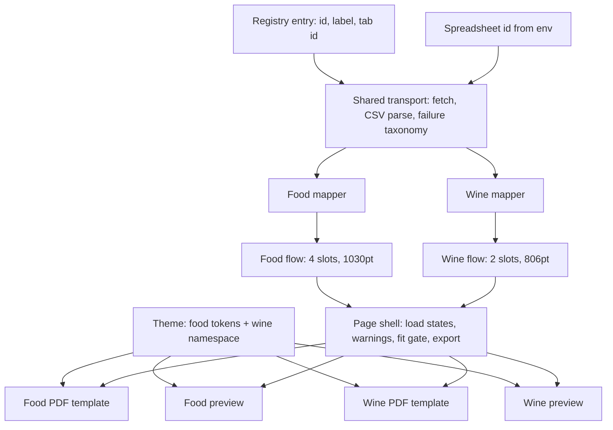
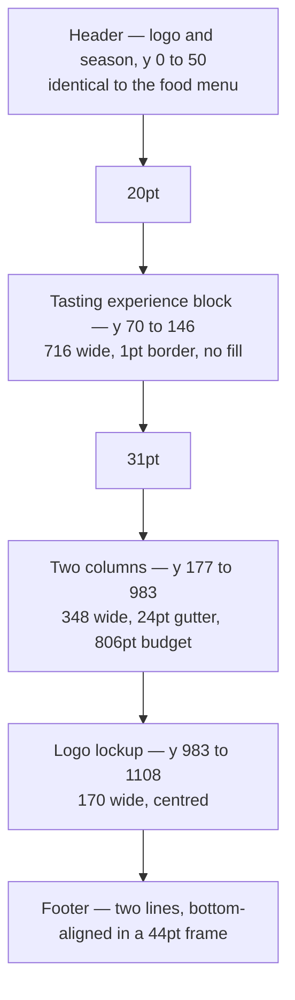
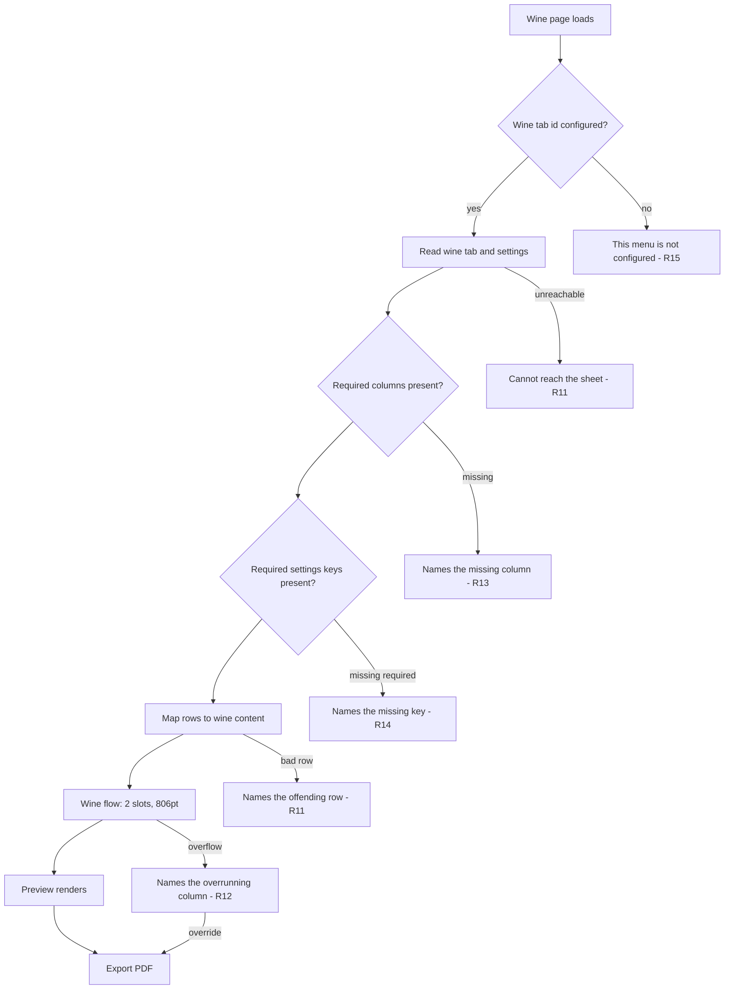

# Wine Menu - Plan

## Goal Capsule

- **Objective:** Give the wine menu the same self-serve path the food menu has — the winery edits its content in the spreadsheet, reads a faithful preview, and exports the print-ready PDF, with no designer in the loop.
- **Product authority:** This plan owns the wine menu's content surface, its layout, and its two renderers. It does not own the wine menu's visual design, which stays in Figma at node `29:5658`.
- **Authority hierarchy:** Requirements (R-IDs) win on product behavior. Key Technical Decisions (KTD-IDs) win on mechanism within their cited requirements. Implementation units override neither.
- **Execution profile:** Sequential with two parallel branches. U1 first. U2, U4 and U6 are independent of each other and of the mapper. U3 needs U2; U5 needs U3 and U4; U7 and U8 need U4, U5 and U6; U9 is last. See Sequencing.
- **Stop conditions:** Stop and surface rather than guess if the wine tab's price columns turn out to be number-formatted (the coercion is not reversible in place), or if the exported wine PDF measures anything other than one 11x17 side. Both change the work rather than the plan.
- **Open blockers:** None.

---

## Product Contract

### Summary

Add the wine menu as a second menu beside the food menu. It reads its own spreadsheet tab, renders one printed side of two columns with a tasting-experience block above them and a centred logo lockup below, and exports the same class of print-ready PDF. The shared loader gains the failure reporting that a second menu makes load-bearing.

### Problem Frame

The food menu already runs end to end: the winery edits a spreadsheet, the page previews both printed sides, and the browser exports the print-ready file. The wine menu was deferred out of that work. Its design exists in Figma and its content is already typed into the spreadsheet on its own tab, so what is missing is code.

The wine menu is not the food menu with different words in it. It prints on one side rather than two, so it has two column slots instead of four. It carries two prices per item rather than one, an appellation, and tasting notes, and none of the dietary tags the food menu's footer legend explains. A bordered tasting-experience block sits above its columns, and a large centred logo lockup sits below them — together they take 212pt out of the column budget, leaving 806pt where the food menu has 1018. Its section headers carry `GLASS` and `BOTTLE` labels, but only on the first section in each column. Every layout constant the food menu is calibrated to is wrong here.

Underneath that sits a second problem the food menu has been living with. The loader reads spreadsheet columns by name and never checks that the header row held them. Rename `Price` to `Prices` today and every item loses its price: the menu renders, nothing warns, and a priceless menu reaches a printer. Missing settings keys behave the same way — they resolve to an empty string. The food menu's exposure is a blanked courtesy line. The wine menu's equivalent is a printed wine list with no 21+ notice, and it adds four more column names to the same silent surface.

### Key Decisions

- KD1. **The wine menu is a second menu beside the food menu, not a widening of the shared machinery.** (session-settled: user-approved — chosen over generalising the existing content model, column flow and template: the food menu is in print and its constants are calibrated to it.) Governs R6, R7, R8, R17.
- KD2. **The tasting-experience block is content, not template copy.** (session-settled: user-approved — chosen over fixing its title, price and description in code: the winery can change a $20 pour price without a designer.) Governs R3.
- KD3. **The wine menu carries its own footer lines.** (session-settled: user-approved — chosen over sharing the food menu's disclaimer: its footer is a 21+ alcohol notice, not a raw-food warning.) Governs R4.
- KD4. **The shared loader's silent-failure paths are closed as part of this work.** (session-settled: user-directed — chosen over deferring them or fixing only the header check: both fixes are small, both make the live food menu safer, and both get harder once two menus depend on the current shape.) Governs R13, R14.
- KD5. **Figma stays master for design and the spreadsheet stays master for content**, as it does for the food menu. Neither holds the other's values. Governs R5, R7.

### Requirements

**Content source**

- R1. The wine menu's content lives on its own tab in the existing spreadsheet, and that tab is the only source of wine menu content.
- R2. The wine tab carries the wine content model: section headings, and per wine a name, a bottle price, a glass price, a location, and tasting notes. Either price may be absent.
- R3. The tasting-experience block's title, price and description are editable from the sheet.
- R4. The wine menu's footer lines come from settings the winery edits, held separately from the food menu's.
- R5. No design value is representable on the wine tab.

**Rendering**

- R6. The wine menu renders one printed side carrying two columns.
- R7. The wine preview and the wine PDF read every design value from the template, so they cannot disagree about size, spacing, colour or typeface.
- R8. Which column a wine section prints in stays computed from how much content there is. No one chooses it and it is not stored.
- R9. The `GLASS` and `BOTTLE` price-column labels print on the first section in each column and nowhere else.
- R10. Export produces one 11x17 side with the typefaces embedded and subsetted.

**Failure handling**

- R11. A wine row the page cannot interpret produces an on-page explanation naming the spreadsheet row.
- R12. Wine content that exceeds the printable area names the column that overruns and disables export, with a deliberate override that states what the override will print.
- R13. A column a mapper needs and cannot find in the header row is reported, rather than rendering a menu with that column's values silently missing.
- R14. A settings key a menu requires and the sheet does not carry is reported, rather than printing as an empty line.
- R15. A wine menu that is unreachable or misconfigured does not affect the food menu's page.

**Coexistence**

- R16. A menu registered without a template is caught before the winery reaches it.
- R17. The food menu's printed output is unchanged by this work.

### Acceptance Examples

- AE1. **Covers R9.** Given the flow places four sections across the two columns, when the menu renders, then exactly the first section in each column carries the `GLASS` and `BOTTLE` labels.
- AE2. **Covers R13.** Given the wine tab's `Tasting notes` header is renamed, when the page loads, then the page reports the missing column and names the header row, rather than rendering wines with blank tasting notes.
- AE3. **Covers R15.** Given the wine tab id is not configured, when the winery opens the food menu, then the food menu renders and exports normally.
- AE4. **Covers R12.** Given wine content that overruns the sheet, when the page loads, then the page names the overrunning column, disables export, and its override states that the overrun will print on a second side the design does not have.
- AE5. **Covers R3.** Given the tasting-experience row's price is changed in the sheet, when the page is reloaded, then the printed block carries the new price.
- AE6. **Covers R14.** Given the wine settings do not carry the 21+ notice, when the page loads, then the page reports the missing key and offers no export.
- AE7. **Covers R17.** Given a PDF exported from the food menu before this work and one exported after, then the two are visually identical.
- AE8. **Covers R2.** Given a wine carrying only a bottle price, when the menu renders, then that price prints in the bottle column and the glass column is empty.

### Success Criteria

- The winery changes a wine's price and holds a print-ready file without contacting the designer.
- A wine menu that reads as correct in the preview prints as correct.
- Adding the wine menu leaves the food menu's printed output untouched.

### Scope Boundaries

**Deferred for later**

- A third menu. The seams this work introduces should carry one, but that is not this work.
- Figma housekeeping on the wine artboard: the placeholder prices are transposed on several rows, the Specialty header is a detached frame at 12px where every other section header on either menu is 14px, and the right column's first item sits 10pt lower than the left's because its header is parented differently. All three are design-file corrections, not code.

**Deferred to follow-up work**

- The rule colour and stroke drift. The Figma files draw section rules at `#CFC1AB`, 1pt; `menus/src/menus/templates/theme.ts` holds `#c9bda6` and `ruleWidth: 0.5`. This affects both menus, so it is a shared-token correction with its own before-and-after check, not wine scope.
- Balancing the two wine columns. The artboard fills left to capacity then spills right, exactly as the food menu does, so this plan reproduces that. A balancing pass would be a design change.
- Balancing warning copy for a half-empty wine column. The artboard's right column ends well short of its budget and the plan reproduces that, so nothing warns when content leaves one column visibly short.

**Not in scope**

- Deploying the site. That remains the outstanding unit on `docs/plans/2026-08-12-001-feat-spreadsheet-menu-content-plan.md`.
- The parked food-menu fragments on the wine artboard (`29:5706`, and the duplicate season text at x=1018). They sit off the 792pt page, they carry food content, and byte-identical twins exist on both food artboards at the same coordinates.
- Dietary tags on the wine menu. The wine item has no tag slot and the wine footer has no legend.
- The line-breaking difference between the browser and the PDF renderer. Inherent to running two renderers; not closed by this work.

### Dependencies / Assumptions

- The wine tab's price columns may never have been formatted as plain text. A price typed as `$30` into a general-formatted cell exports as `$30.00`, and reformatting afterwards does not restore it — the cell must be retyped. The tab already holds 13 items, so verify this before attributing a `$30.00` to the code.
- The artboard's placeholder prices disagree with the spreadsheet and are internally inconsistent about which column holds which price. The component's structure is not ambiguous: the label and price frame at x=235/230 are glass, and at x=297/273 are bottle. The spreadsheet is master for values.
- `vitest` runs with no configuration file and resolves no `@` path alias. It works today only because the single aliased import in the test graph is type-only and is erased at transform. Any test that reaches a module importing `@/…` at value position will fail to resolve.
- The bottom lockup is the header logo's artwork scaled non-uniformly — roughly 16% taller in proportion. Deriving it by transforming the header mark will drift from the artboard.

---

## Planning Contract

### Key Technical Decisions

- KTD1. **Resolve the sheet tab per menu, and let a missing one fail only that menu.** `sheetConfigFromEnv()` today reads three fixed variables and returns `null` unless all three are present, and the page's load path never passes its menu id. Adding a fourth required variable would blank the live food menu when the wine tab is unset; leaving the load path unchanged would render food content at the wine URL with no error. The tab id lives in the menu's source spec (KTD13), not on the registry entry, so the registry stays pure metadata and the transport never imports the menu catalogue. Read each variable by literal property access — Next inlines `NEXT_PUBLIC_*` only for literal reads, so a table that looks env up by variable name resolves to `undefined` in the browser. Governs R1, R15.
- KTD2. **The wine tab keeps the food tab's positional row grammar and adds one row type for the feature block.** A wine belongs to the nearest section row above it, exactly as an item does today, so there is no second source of order. The tasting-experience block is a row of its own type rather than a settings key, so its price sits beside the prices it is priced against. Governs R2, R3.
- KTD3. **The shared module names no menu.** Fetching, CSV parsing, and the failure taxonomy are common and stay in one module. Everything with a menu in it — the column aliases, the row grammar, the content mapping — moves out beside that menu's mapper, food's included. Leaving food's mapper and its alias table inside the module called shared would make each menu's header vocabulary silently valid for the other, and would widen the machinery KD1 says not to widen. Governs R2, R17.
- KTD4. **A mapper declares the headers it requires, and a missing one is a row-1 failure naming the tab.** The check runs against the parsed header row before any content row is read, so the message points at the header rather than at a wine. Every row-level failure carries the tab it came from: with two menus the spreadsheet has four tabs, and a bare row number is ambiguous across them. This closes the only failure in the system that degrades every row at once while reporting nothing. Governs R13.
- KTD5. **Settings keys are typed required or optional per menu, and an unconfigured menu is its own failure kind.** A required key that is absent is a blocking failure naming the key and its tab; an optional key that is absent stays an empty string. The wine menu marks its 21+ notice required. A menu whose tab id was never configured is not `unreachable` — that kind offers a retry, and retrying cannot change a value fixed at build time. Governs R14, R15.
- KTD6. **The wine menu gets its own layout module, with its own slot count, column budget and line-width calibration.** Two slots, `Left` and `Right`. A column budget of 806pt, derived from the artboard: columns start at y=177 and must end at y=983 where the logo frame begins. Characters-per-line is re-measured against the wine text column of 230pt rather than inherited from the food menu's 314pt — the artboard's own wraps put it near 38 to 40, against the food menu's 54. The food menu's `layout.ts` is not touched. Governs R6, R8, R12, R17.
- KTD7. **A wine section never splits across the column break.** The food menu allows splitting because its artboard depends on it; the wine artboard has no split, and a headingless continuation at the top of the right column would also arrive without price-column labels. A section too tall for a whole column still overflows visibly rather than being dropped. Governs R8, R9.
- KTD8. **Budget the price-label height into every wine section header, whether or not the labels print.** The label rule makes a header's height depend on its position, while the flow computes position from heights — a loop the food menu does not have, because its add-on line is a property of the block regardless of where it lands. Paying the height everywhere keeps placement a pure function of content. Governs R8, R9.
- KTD9. **Wine design values live in their own namespace in the theme, and no existing food token is retuned.** The wine menu contradicts `space.itemTextWidth`, `space.priceColumnWidth`, `space.afterHeaderDivider` and the effective description line height, and it introduces a colour (`#536940`) nothing else uses. Editing any of those in place would move a menu that is already in print. Governs R7, R17.
- KTD10. **Generate the bottom lockup from a fresh Figma export into both renderers.** No horizontal lockup exists in either `menus/src/menus/templates/logo.tsx` or `menus/src/components/Logo.tsx`, and the two cannot share a component — react-pdf's `Svg`/`Path` are not DOM elements, and the PDF marks bake the gold in while the DOM marks take `currentColor`. Governs R10.
- KTD11. **Catch a half-registered menu at compile time, not in a test.** Derive the menu-id union from the registry, and type both the template map and the menu-kind table as total records over it. A forgotten registration then fails `next build`. A runtime test asserting the same thing would have to reach the template module, which pulls `@react-pdf/renderer` and its module-level font registration into a Node test process. Keep one cheap source-text assertion that neither the registry nor the menu-kind module reaches the template module or the PDF package. Governs R16.
- KTD12. **Add a `vitest` config with the `@` alias before any new test needs it.** The wine mapper reaches modules that import `@/…` at value position. Adding the config also changes how the existing test files resolve, so the full suite is re-run on that change alone. Governs R2, R13.
- KTD13. **Each menu supplies one bundle: tab id, column aliases, required columns, required settings keys, mapper, column flow, preview element, and overflow advice.** Two constraints pick this over the alternatives, and both are import-graph facts rather than taste. The registry is read by a server component, so it cannot carry mappers, flows or client components. The PDF engine is reachable only through the dynamic import inside the export handler, so the bundle must never name a template. Branching on the menu id inside the page shell was rejected because it would put a menu conditional in the load path, the flow call, the preview choice and the fit copy — making the one file this plan keeps menu-agnostic the file every menu edits. One page component per menu was rejected because the surface being duplicated is the failure renderer, and this work adds three cases to it. The bundle splits in two: a source half (tab id, aliases, required columns, required settings keys, mapper) that is pure and server-safe, and a render half (flow, preview element, overflow advice) that is client-only. The shell selects its own bundle from the menu id — a server component cannot pass a function across the client boundary. Governs R6, R12, R15, R16.
- KTD14. **The shell holds no content type.** The transport's result is parameterised by content type. The shell touches content in three places — it hands blocks to the flow, hands content to the preview, and reads the season for the download filename — and once the flow and the preview move into the bundle, its only remaining requirement is that content carries a season. That is the constraint it holds: a narrow structural one, not `unknown` and not a union of both menus. The bundle and the template map each re-narrow to their own concrete type inside their own entry. The preview is exposed as a function returning an element rather than a component reference, so the shell never has to name its prop types. Governs R7, R11, R17.

### High-Level Technical Design

**Where the two menus share and where they diverge.** The transport, the failure taxonomy, and the page's state machine are common. Everything downstream of a parsed row is per menu.

**The wine sheet's vertical budget.** The two regions the food menu does not have are what reduce the column height from 1018pt to 806pt. Both are fixed bands, subtracted before any content is placed.

**Where a wine load can end.** Three exits are new: the missing-column check, the required-settings check, and an unconfigured tab that must not reach the food menu.

### Sequencing

U1 lands first: it makes the loader menu-aware, and every later unit reads content through it. U2 defines the sheet contract that U3's mapper is written against, so it precedes U3 rather than documenting it afterwards. U4 and U6 depend on nothing and can run alongside the mapper work. U5 needs U3's content shape and U4's tokens. U7 and U8 both need U4, U5 and U6, and they are the pair most exposed to drift — write them against the same tokens and diff their output against each other before either is considered done. U9 is last and needs everything.

Two consequences of that order are worth stating. U1 changes code the live food menu runs, so its before-and-after PDF check is the gate on the whole plan rather than a formality. And U5 cannot be calibrated from the artboard's metadata alone — the characters-per-line figure has to be checked against real tasting notes, which is why U3 lands first and supplies them.

### Risks and rollout

| Risk | Mitigation |
|---|---|
| Hardening the shared loader regresses the food menu, which is in print. | U1 carries the before-and-after food PDF comparison, and it runs before any wine code exists so a regression has one possible cause. |
| The wine estimator inherits the food menu's calibration and strands a print. The wine text column is 230pt against the food's 314, so the food's 54 characters per line over-estimates by roughly a third, and the wine card has far less slack to absorb it. | KTD6 re-measures against the artboard's own wraps. U5 pins the boundary with tests built from real tasting notes that do and do not wrap. |
| The preview and the PDF drift, doubling a hazard the food menu already carries. | KTD9 gives wine its own token namespace that both renderers read, and U7 and U8 are verified against each other rather than only against the artboard. |
| The label-height feedback loop places a section as first-in-column using a short header, then renders it tall and overruns. | KTD8 removes the loop by paying the label height on every header. |
| The bottom lockup is derived from the header mark and prints subtly wrong. | KTD10 exports fresh artwork. The lockup is ~16% taller in proportion than the header logo, so a uniform scale is visibly wrong at 138pt wide. |
| A wine misconfiguration blanks the food menu. | KTD1 resolves per menu; AE3 is the check. |
| The per-menu bundle grows a template reference and pulls the PDF engine into the prerendered graph. The module already collects everything per-menu, and a template is per-menu, so it is one plausible edit away — and it would not reliably fail the build. | KTD13 forbids it by name, and U9 asserts from source text that neither the bundle nor the registry reaches the template module or the PDF package. |
| The wine tab's prices were typed before the columns were plain text and print as `$30.00`. | U2 verifies the existing tab's formatting before any code depends on it. Not recoverable by reformatting; the cells must be retyped. |

**Rollback.** There is no data to roll back. The design lives in Figma and in `menus/src/menus/templates/`, the content lives in the spreadsheet with its own revision history, and the food menu's last exported PDF stays printable throughout. Removing the wine menu is removing its registry row.

---

## Implementation Units

### U1. Make the loader menu-aware and its structural failures visible

**Goal:** Content loads per menu, a missing tab affects only its own page, and a sheet the loader cannot read structurally says so.

**Requirements:** R1, R13, R14, R15, R17. Implements KTD1, KTD3, KTD4, KTD5, KTD12, KTD13, KTD14.

**Dependencies:** none.

**Files:**
- `menus/src/lib/sheet.ts` (transport and failure taxonomy only, once the food specifics move out)
- `menus/src/lib/food-sheet.ts` (new — the food mapper and its source spec, mirroring where the wine mapper will sit)
- `menus/src/lib/sheet.test.ts`
- `menus/src/menus/kinds.ts` (new — the source half of the per-menu bundle)
- `menus/src/components/Editor.tsx` (select the bundle from the menu id; hold no content type)
- `menus/.env.local.example`
- `menus/vitest.config.ts` (new)

**Approach:**
1. Add the `vitest` config with the `@` alias first, and re-run the existing suite on that change alone. The existing test files resolve differently afterwards.
2. Parameterise the transport's result by content type, and narrow the shell's requirement on content to carrying a season (KTD14). Without this the transport stays typed to the food model and U3's mapper cannot reuse it.
3. Split the food specifics out of the shared module (KTD3). The column aliases and the row grammar move beside the food mapper; the shared module keeps fetching, CSV parsing, and the failure taxonomy.
4. Introduce the source half of the per-menu bundle (KTD13): tab id, column aliases, required columns, required settings keys, and mapper. Read each environment variable by literal property access. Keep the spreadsheet id and the settings tab id where they are — renaming either would break a deployed environment file.
5. Add the unconfigured failure kind, and have the shell render it without a retry affordance.
6. Add a required-header check that runs against the parsed header row before any content row, and reports a row-1 failure naming the missing column and its tab.
7. Type settings keys as required or optional per menu. A missing required key becomes a blocking failure naming the key and its tab; optional keys keep today's empty-string behaviour.

**Patterns to follow:** `menus/src/lib/sheet.ts` already establishes the described-failure convention (`unreachable` / `empty` / `row`, each carrying the spreadsheet's own row number) and the injectable `Fetcher`. Extend that taxonomy rather than introducing a second error style. `menus/src/lib/sheet.test.ts` builds CSV from a `HEADERS` constant that reproduces the sheet's real header spelling, including its stray spaces — keep that.

**Execution note:** Write the header-check and required-settings tests first, against the food menu's own grammar. Both are behaviours the food menu should already have had, so they should fail against today's code before any wine work exists.

**Test scenarios:**
- Covers AE2. A menu tab missing a required column returns a failure naming that column and pointing at the header row.
- A tab whose headers carry different capitalisation and stray spaces still satisfies the required-header check.
- A required settings key that is absent returns a blocking failure naming the key and its tab.
- An optional settings key that is absent still yields an empty string.
- Covers AE3. Resolving the food menu's config succeeds while the wine menu's tab id is unset.
- Resolving a menu whose tab id is unset returns the unconfigured failure naming that menu, not `null` for every menu, and not the unreachable kind.
- A row-level failure names the tab it came from as well as the row number.
- The existing food-menu mapping tests pass unchanged.

**Verification:** `npm test` passes, including the three existing files under the new config. `npm run build` stays green. A food menu PDF exported after this unit is visually identical to one exported before it.

---

### U2. Define the wine sheet contract and prepare the tab

**Goal:** The wine tab is in the shape U3 will parse, with the guard rails and the formatting that code cannot fix afterwards.

**Requirements:** R1, R2, R3, R4, R5. Implements KTD2.

**Dependencies:** none.

**Files:**
- `menus/docs/sheet-setup.md` (a wine-tab section beside the food one)
- The spreadsheet itself (external artefact, not in the repo)

**Approach:**
1. Verify the existing tab's `Bottle price` and `Glass price` columns are formatted as plain text before anything else. This is the irreversible step, the tab already holds 13 items, and the existing instructions name columns B and C — correct for the food grammar, wrong for wine, where the price columns are C and D.
2. Record the wine tab's columns: `Type`, `Name`, `Bottle price`, `Glass price`, `Location`, `Tasting notes`.
3. Define the row types the wine grammar accepts — a section, a wine, and the tasting-experience block — and state which columns each uses. `Note` is not a wine row type; a copied chef's-note row must be rejected by name.
4. Add the wine tab's settings keys, including the 21+ notice as a required key. Leave the food menu's existing keys untouched; renaming one would blank a live footer.
5. Add data validation on the wine tab's type column with its own value list, and conditional formatting by type, matching what the food tab already does.
6. Extend the winery-facing card with the wine tab: which tab feeds which page, that the price columns are plain text on purpose, and that a wine may carry one price or two.

**Test expectation: none** — this unit produces a document and an external artefact. U3's tests assert against the shape it defines.

**Verification:** The wine tab's CSV export endpoint returns the 13 wines with prices reading `$30` rather than `$30.00`. The tasting-experience row is present and its type validates. The instruction card names the two-tab split and the plain-text price columns.

---

### U3. Add the wine content model and map the wine tab

**Goal:** A module that turns the wine tab's CSV into wine content, or into a described failure.

**Requirements:** R2, R3, R5, R11. Serves AE5, AE8. Implements KTD2, KTD3.

**Dependencies:** U1, U2.

**Files:**
- `menus/src/lib/schema.ts` (the wine content types and their guards)
- `menus/src/lib/wine-sheet.ts` (new — the wine mapper and its source spec)
- `menus/src/lib/wine-sheet.test.ts` (new)
- `menus/src/menus/kinds.ts` (the wine menu's source-half entry)

**Approach:**
1. Add the wine content types alongside the food ones: a wine carries a name, a bottle price, a glass price, a location and tasting notes, all strings, with either price allowed to be empty. Wine content carries an ordered block list, the tasting-experience block, the season, and its own footer lines.
2. Extend the existing nested type-guard convention rather than introducing a second validation style.
3. Reuse the shared transport from U1 for fetching, parsing, and the failure taxonomy. Only the row-to-content mapping is new.
4. Fold rows positionally: a section row opens a section, wine rows attach to it, the tasting-experience row is a standalone block.
5. Synthesise block and wine ids from the spreadsheet row number, so the same tab always maps to the same content and a bad row keeps a durable position.
6. Declare the wine tab's column aliases, required columns and required settings keys in its source spec beside the mapper, and register that spec as the wine menu's source-half bundle entry (KTD13). The wine tab's vocabulary must not reach the food menu's.
7. Never throw past the caller. Zero mapped blocks is the described empty failure, not a blank menu.

**Patterns to follow:** `menus/src/lib/sheet.ts`'s `mapRows` for the fold, its `clean()` for the quote-stripping Sheets adds to cells beginning with `+` or `-`, and `menus/src/lib/schema.ts`'s reject-rather-than-coerce guards. `menus/src/lib/sheet.test.ts` for fixture shape: header constants reproducing real spelling, CRLF joins, and narrowing helpers that throw on the wrong branch.

**Execution note:** Write the mapper test-first against fixture CSV captured verbatim from the wine tab, including the row whose tasting notes carry an embedded newline (`The Keeper`) and a name carrying a comma.

**Test scenarios:**
- A well-formed wine tab maps to blocks in sheet order.
- A wine row after a section row attaches to that section.
- A wine row before any section is reported as a failure naming that row.
- Covers AE8. A wine with only a bottle price maps with the glass price empty, and the reverse.
- A wine with neither price maps, and the result carries a warning naming that row.
- Tasting notes containing an embedded newline survive parsing intact.
- A wine name containing a comma inside quotes does not shift later columns.
- Covers AE5. The tasting-experience row maps to its own block carrying title, price and description.
- A second tasting-experience row is reported as a failure naming that row.
- A tab with no tasting-experience row maps successfully, and the content carries no such block.
- A row typed `note` is reported as a failure naming the wine grammar's own row types.
- A row with a blank type is reported as a failure naming that row.
- Covers AE6. Wine settings missing the 21+ notice return the required-key failure.
- A wine tab with a header row and no data rows returns the empty failure.
- The same fixture maps to the same block and wine ids on repeated parses.

**Verification:** `npm test` passes. Fixtures include at least one CSV captured verbatim from the live wine tab.

---

### U4. Add the wine design tokens to the theme

**Goal:** Every wine design value has one home, and no food token moves.

**Requirements:** R5, R7, R17. Implements KTD9.

**Dependencies:** none.

**Files:**
- `menus/src/menus/templates/theme.ts`

**Approach:**
1. Add a wine namespace rather than editing existing keys. The wine menu contradicts `space.itemTextWidth` (230 against 314), `space.priceColumnWidth` (two columns of 43 and 71 against one of 34), and `space.afterHeaderDivider` (its columns begin 127pt below the divider, not 24).
2. Record the feature block: 716 wide, 76 tall, 1pt border, no fill, no corner radius, 16pt padding, 20pt below the header divider and 31pt above the columns. Its title is 20pt medium with 1pt tracking, its price 20pt medium right-aligned, its body 16pt in the serif face, and all three take the new colour `#536940`.
3. Record the wine item: a 230pt text column, then price columns of 43 and 71, right-aligned. Name at 16pt medium with 1pt tracking on a 22pt line; location and tasting notes at 14pt serif on 17pt lines; 2pt between an item's own lines and 10pt between items.
4. Record the wine section header: 22pt tall, name at 14pt with 2pt tracking, and the two label positions at x=235 and x=297.
5. Record the column geometry and the two fixed bands: columns start at y=177 and end at y=983, the logo frame is 170 wide and centred, and the footer holds two lines bottom-aligned in its 44pt frame.
6. Mark each value MEASURED or APPROX, as the existing tokens do. Do not carry the artboard's evident errors into the theme — the Specialty header's 12px and the right column's 10pt offset are listed under Scope Boundaries as design-file corrections.

**Patterns to follow:** `menus/src/menus/templates/theme.ts`'s existing structure and its MEASURED/APPROX annotation convention, including the node ids that justify a value.

**Test expectation: none** — a token module with no behaviour of its own. U5, U7 and U8 assert against it.

**Verification:** `npx tsc --noEmit` passes. No existing food token's value has changed, confirmed by diff.

---

### U5. Compute the wine column flow

**Goal:** Wine content lands in two columns on one side, and content that does not fit says which column overran.

**Requirements:** R6, R8, R9, R12. Serves AE1, AE4. Implements KTD6, KTD7, KTD8.

**Dependencies:** U3, U4.

**Files:**
- `menus/src/menus/templates/wine-layout.ts` (new)
- `menus/src/menus/templates/wine-layout.test.ts` (new)

**Approach:**
1. Write a wine flow beside the food one. Two slots labelled `Left` and `Right`, an 806pt budget, and estimators calibrated to the wine item. Leave `menus/src/menus/templates/layout.ts` untouched.
2. Re-measure characters-per-line against the 230pt text column. The artboard's own wraps bound it: a 37-character note stays on one line and a 41-character note wraps to two, so the figure sits between them rather than at the food menu's 54.
3. Give the wine item exactly the two heights the artboard has — one where the tasting notes fit a line and one where they wrap to two — and account for the location line, which never wraps in the current content but can.
4. Budget the price-label height into every section header regardless of position, per KTD8.
5. Mark the first section fragment in each column as label-bearing, so the renderers do not each decide it independently.
6. Do not split a section across the column break. A section too tall for a whole column is placed and raises the overflow condition, so it is visible rather than dropped.
7. Report which column overran, as the food flow does.

**Patterns to follow:** `menus/src/menus/templates/layout.ts` for the fragment shape, the leading-gap discipline (gaps between elements, never trailing), and the overflow reporting. `menus/src/menus/templates/layout.test.ts` for the premise-assertion style — establish that a case is meaningful before asserting the behaviour under test.

**Execution note:** The estimator is the part of this plan most likely to be wrong in a way that only shows up in print. Build the fixtures from the live wine tab's real tasting notes rather than synthetic strings, and pin the wrap boundary from both sides.

**Test scenarios:**
- Covers AE1. Given four sections across two columns, exactly the first fragment in each column is marked label-bearing.
- The current wine content places its four sections as the artboard does — Whites & Rosé and Reds in the left column, Blends and Specialty in the right.
- A tasting note of the measured one-line length does not add a second line to its item's height.
- A tasting note just past that length adds exactly one line.
- A section that fits in a whole column is never split across the break.
- A section taller than a whole column is placed and raises overflow rather than being dropped.
- Covers AE4. Content exceeding both columns reports overflow and names the column that ran over.
- A section header's estimated height is the same whether it lands first in a column or after another section.
- Content that fits reports no overflow.

**Verification:** `npm test` passes. The flow places the live wine content the way the artboard does, column by column.

---

### U6. Generate the bottom logo lockup for both renderers

**Goal:** The centred lockup exists as artwork in the PDF and in the DOM, from the same export.

**Requirements:** R10. Implements KTD10.

**Dependencies:** none.

**Files:**
- `menus/src/menus/templates/assets/` (the Figma SVG export)
- `menus/src/menus/templates/logo.tsx` (the react-pdf mark)
- `menus/src/components/Logo.tsx` (the DOM mark)

**Approach:**
1. Export the lockup from Figma node `29:6275` rather than scaling the header mark. It is the same artwork non-uniformly scaled — about 16% taller in proportion — so a uniform scale is visibly wrong at 138pt wide.
2. Generate the react-pdf mark into `logo.tsx` beside the existing wordmark and cellars mark, following their generated-file convention. The PDF marks bake `#8C734B` into their paths.
3. Generate the DOM mark into `components/Logo.tsx`, which takes `currentColor` rather than a baked fill.
4. Keep both files marked as generated. Hand-editing path data drifts from the artboard, and nothing downstream would catch it.

**Patterns to follow:** the existing `ElsomWordmark` / `CellarsMark` pair in `menus/src/menus/templates/logo.tsx` and `ElsomLogo` in `menus/src/components/Logo.tsx`, including their headers explaining why the two cannot be one component.

**Test expectation: none** — generated artwork. Its correctness is a visual comparison, covered by U7's and U8's verification.

**Verification:** The lockup renders at 138 by 85.6 points in both renderers and matches the artboard when overlaid.

---

### U7. Render the wine PDF template

**Goal:** Export produces the wine menu as one printed side.

**Requirements:** R6, R7, R9, R10. Serves AE1, AE8. Implements KTD9.

**Dependencies:** U4, U5, U6.

**Files:**
- `menus/src/menus/templates/WineMenu.tsx` (new)
- `menus/src/menus/templates/index.tsx` (widen the dispatch to carry a flow; register the wine template)
- `menus/src/menus/templates/FoodMenu.tsx` (take the flow as a prop; delete its own call)

**Approach:**
1. Write one `Document` holding one `Page`, against the food template's structure so the two stay reviewable side by side.
2. Take the column flow as a prop rather than computing it, so the page's fit gate and the export cannot disagree. The dispatch has to widen to carry a flow for the wine template anyway, so hand the food template its flow in the same change and delete its own call — otherwise the templates folder ships two contracts about who owns placement, and the third menu copies whichever it meets first. The flow is pure and deterministic over the same input, so the printed output cannot move; the food PDF comparison is the check.
3. Reuse the header unchanged — it is identical to the food menu's on every value, logo, season label and divider alike.
4. Draw the feature block above the columns when the content carries one, and let the columns take its room when it does not.
5. Draw the price-column labels only on fragments the flow marked label-bearing.
6. Draw the footer as two lines, bottom-aligned in its frame, with no dietary legend.
7. Honour the react-pdf constraints the food template records: no z-index, `fontFamily` does not reliably inherit into nested text, and items do not wrap.
8. Read every value from the theme's wine namespace. A literal here is the drift this plan exists to avoid.

**Patterns to follow:** `menus/src/menus/templates/FoodMenu.tsx` — its single `StyleSheet.create` grouped by comment banner, its `fixed` header and footer, and its recorded react-pdf quirks. `menus/src/menus/templates/fonts.ts` is reused unchanged; `legend.ts` is not imported, as the wine menu has no tag legend.

**Test scenarios:**
- Covers AE1. Only the label-bearing fragments render the `GLASS` and `BOTTLE` labels.
- Covers AE8. A wine with one price renders that price in its own column, leaving the other empty.
- Content carrying no tasting-experience block renders without it, and the columns start higher.
- The document renders exactly one page for content that fits.

Component-level scenarios are proven by the manual gates in the Verification Contract; the test runner is scoped to the parsing and layout layers.

**Verification:** A PDF exported from the running app measures one 11x17 side, reports the expected typefaces as embedded and subsetted, and matches the artboard column by column.

---

### U8. Render the wine preview

**Goal:** The screen shows what the wine menu will print.

**Requirements:** R6, R7, R9. Serves AE1. Implements KTD9.

**Dependencies:** U4, U5, U6.

**Files:**
- `menus/src/components/WinePreview.tsx` (new)
- `menus/src/app/globals.css` (only if a state needs a class the sheet does not have)

**Approach:**
1. Render one sheet, not two, and drop the front/back captions.
2. Reuse the existing scaling wrapper — the resize-observed transform that draws a true-point-size page at the container's width is menu-agnostic.
3. Repeat the baseline reset. The app's inherited line height and letter spacing cost the column area roughly 35pt if they reach the sheet root.
4. Take the same flow result the PDF template takes, from the same call.
5. Read every value from the theme's wine namespace, through the existing web-to-react-pdf face map.

**Patterns to follow:** `menus/src/components/MenuPreview.tsx` — its `Sheet` scaling wrapper, its `face` map translating registered PDF family names to CSS stacks, and the no-literal-design-values rule stated in its header.

**Execution note:** This unit and U7 are the drift pair. Export a PDF and screenshot the preview at the same content, and compare them before calling either done — a type check proves nothing here.

**Test scenarios:**
- Covers AE1. The preview marks the same fragments label-bearing as the PDF does, from the same flow result.
- The preview renders one sheet.
- Content carrying no tasting-experience block renders without it.

Component-level scenarios are proven by the manual gates in the Verification Contract.

**Verification:** The preview and an exported PDF of the same content agree on type size, spacing, colour and typeface at the header, the feature block, a section header with labels, a wine with two prices, and the footer.

---

### U9. Wire the wine menu into the page shell and document it

**Goal:** The winery opens the wine menu, reads it, and exports it.

**Requirements:** R1, R4, R11, R12, R15, R16, R17. Serves AE3, AE4, AE6. Implements KTD11, KTD13, KTD14.

**Dependencies:** U1, U3, U5, U7, U8.

**Files:**
- `menus/src/components/Editor.tsx`
- `menus/src/menus/registry.ts` (the wine metadata row)
- `menus/src/menus/kinds.ts` (the render half of the per-menu bundle)
- `menus/src/menus/kinds.test.ts` (new)
- `menus/README.md`
- `menus/docs/sheet-setup.md`

**Approach:**
1. Keep the page shell's state machine menu-agnostic — loading, the failure branches, warnings, the export handler and its error reporting all stay as they are. The shell selects its own bundle from the menu id; the route passes strings only, since a server component cannot pass a function across the client boundary.
2. Add the render half of the bundle (KTD13): the flow function, the preview element function, and the overflow advice. The source half already exists from U1 and U3.
3. Carry the fit-gate copy as bundle data rather than a branch in the shell. The food menu's slot vocabulary does not survive a single-sided sheet, and the override's consequence changes: an overrun here prints on a second side the design does not have. The overflow column name already comes back from the flow, so only the advice string is per menu.
4. Keep the export handler's dynamic import exactly where it is. It is the one import shape that resolves under this Next version, and reaching a template any other way pulls the PDF engine into the prerender graph. Pass the already-computed flow through it, for both menus.
5. Add the wine menu's registry row with its own description. The home-page card is the only place staff learn which menu is which.
6. Type the template map and the bundle table as total records over the registry's menu-id union (KTD11), so a forgotten registration fails the build.
7. Update `menus/README.md`: the wine menu is no longer outstanding, the "Adding the wine menu" recipe describes the seams that now exist, and the "Where things live" table gains the new modules. Correct the stale comments in `registry.ts` and `templates/index.tsx`, which still describe the pre-spreadsheet workflow and predate the per-menu tab id.

**Patterns to follow:** `menus/src/components/Editor.tsx` already isolates the PDF engine behind a dynamic import inside the click handler and branches on `failure.kind`. Extend both rather than adding a second shape.

**Test scenarios:**
- Covers R16. Removing a menu's template entry fails the type check rather than reaching the winery — asserted by the totality typing, not a runtime test that would import the PDF engine.
- Neither the registry nor the menu-kind module reaches the template module or the PDF package, asserted from source text.
- Covers AE3. With the wine tab id unset, the food menu's page still resolves its config and loads.
- The unconfigured failure renders without a retry control.

**Verification:** `npm run build` stays green. The wine page renders the live wine tab and exports a PDF. The food page is unchanged, confirmed against a PDF exported before the plan began.

---

## Verification Contract

The test runner is scoped to the parsing and layout layers. It does not render components, so every component-level scenario in U7, U8 and U9 is proven by a manual gate below. In PowerShell call `npm.cmd` rather than `npm` — the execution policy blocks the unsigned `npm.ps1`. Git Bash is unaffected.

| Gate | Command | Applies to | Proves |
|---|---|---|---|
| Type check and build | `npm run build` | U1, U3, U4, U5, U7, U8, U9 | Compiles, and the static export still produces `out/` with no server-rendered route |
| Standalone type check | `npx tsc --noEmit` | all code units | Types without a full build |
| Unit tests | `npm test` | U1, U3, U5, U9 | Loader hardening, wine mapping, wine flow, and registry consistency |
| Manual: food regression | export the food PDF before U1 and after U9 | U1, U4, U9 | The food menu's printed output did not move |
| Manual: wine round trip | dev server, edit the wine tab, reload | U3, U9 | An edit on the wine tab appears in the wine preview |
| Manual: wine page states | dev server, break the wine tab six ways | U1, U3, U9 | Unreachable, missing column, missing required key, bad row, empty, and unconfigured each render |
| Manual: wine fit gate | dev server, overrun a wine column | U5, U9 | Export disables, names the column, and the override states what it will print |
| Manual: preview against export | screenshot the preview, export the PDF, compare | U7, U8 | The two renderers agree on every value they both draw |
| Manual: exported artefact | download the wine PDF and inspect it | U6, U7 | One 11x17 side, typefaces embedded and subsetted, lockup matching the artboard |

There is no lint script and no CI. `next build` performs the type checking, including generated route signatures.

---

## Definition of Done

**Global**

- Every requirement R1 to R17 is implemented or explicitly deferred in Scope Boundaries.
- `npm run build` produces a static `out/` with no server-rendered route.
- `npm test` passes, including the existing food-menu tests under the new runner config.
- A food menu PDF exported after this work is visually identical to one exported before it.
- The wine page renders the live wine tab and exports a one-sided PDF with the typefaces embedded.
- The wine preview and the wine PDF agree at the header, the feature block, a labelled section header, a two-price wine, and the footer.
- A missing wine tab id leaves the food menu working.
- `menus/docs/sheet-setup.md` covers the wine tab's columns, its row types, its settings keys, and the plain-text price columns.
- `menus/README.md` reflects the change. Three passages go stale otherwise: the status note calling the wine menu outstanding, the "Adding the wine menu" recipe, and the "Where things live" table.
- Abandoned experimental code is removed. A run that tries an approach and drops it does not leave that code in the diff.

**Per unit**

Each unit is done when its Verification line holds and its test scenarios pass. U1 additionally requires the food-menu PDF comparison, since it is the only unit that changes code the live food menu runs before any wine code exists.

---

## Sources / Research

**In this repo**

- `menus/src/lib/sheet.ts` — the shared transport, the described-failure taxonomy U1 extends, and the header-name matching that fails silently today.
- `menus/src/lib/schema.ts` — the nested type-guard convention and the reject-rather-than-coerce rule U3 extends.
- `menus/src/menus/templates/layout.ts` — the food flow, its 1030pt budget, and the two corrections it records from checking against the artboard rather than reasoning about it.
- `menus/src/menus/templates/theme.ts` — the token structure and the MEASURED/APPROX convention U4 follows.
- `menus/src/components/MenuPreview.tsx`, `menus/src/menus/templates/FoodMenu.tsx` — the two-renderer pair U8 and U7 mirror, including the baseline reset and the recorded react-pdf constraints.
- `menus/src/menus/templates/logo.tsx`, `menus/src/components/Logo.tsx` — why the PDF and DOM marks cannot be one component.
- `docs/plans/2026-08-12-001-feat-spreadsheet-menu-content-plan.md` — the food menu's plan. Its R4, R6, R12 and R14 carry into this work; its U9 (deployment) remains outstanding and is not in this scope.

**In Figma**

- File `ciJhmsPGUj0Gge5PKpBzhe`, page "POR", node `29:5658` — the wine artboard. Measured values and the node ids that justify them are recorded against the tokens in U4.
- Node `29:6262` — the tasting-experience block, and the source of the `#536940` olive that no other token carries.
- Nodes `32:6727`, `32:6752`, `32:6758`, `29:6118` — the section headers. The label-only-on-the-first-section rule is structural, not inferred: the second section in each column carries its label nodes explicitly hidden.
- Node `29:6275` — the bottom lockup U6 exports.
- Nodes `22:977` and `22:1065` — the food artboards, used to confirm the wine header is identical and that the parked fragments at x>=786 exist on both food sides at the same coordinates.
